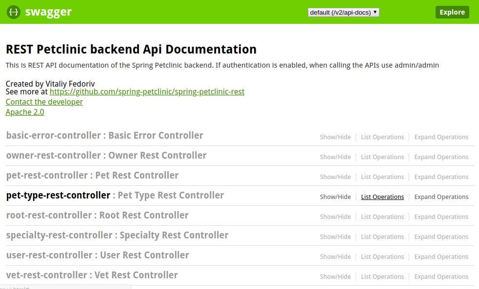
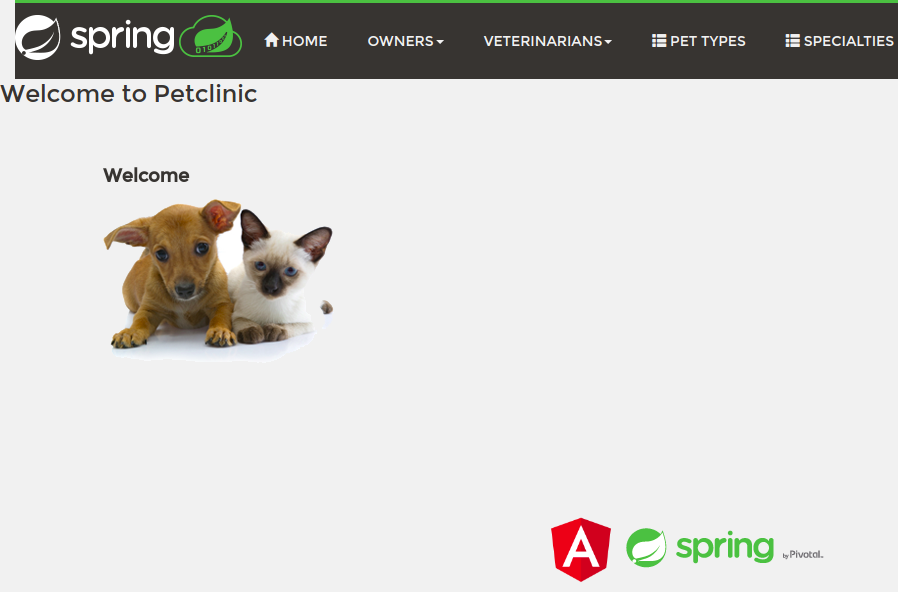

# Spring Petclinic
A combination of Vagrant and Shell scripts to provision a Centos 7 virtual machine and deploy the [spring-petclinic](https://github.com/spring-petclinic) Angular front-end and REST API into Docker containers
## Setup Guide
#### Requirements
- [Git](https://git-scm.com/downloads)
- [Virtualbox](https://www.virtualbox.org/wiki/Downloads)
- [Vagrant](https://www.vagrantup.com/downloads.html)

If you are on Windows and have the [Chocolatey package manager](https://chocolatey.org/), these can all be installed with this command
```bash
choco install -y git virtualbox vagrant
```
#### Installation Steps
Use the following commands:
1. Clone this GitHub repository:
    ```bash
    git clone https://github.com/bob-crutchley/spring-petclinic && cd spring-petclinic
    ```
2. Run the Vagrant scripts:
    ```bash
    vagrant up
    ```

Other usage notes:
- You can use `vagrant destroy -f` to stop and delete the virtual machine

#### Verifying the installtion
##### Check the Petclinic REST API is running by navigating to here in a web browser:
    http://10.0.10.10:9966/petclinic/swagger-ui.html



##### Check the Petclinic Angular front-end is running by navigating to here in a web browser:
    http://10.0.10.10:4200/petclinic



